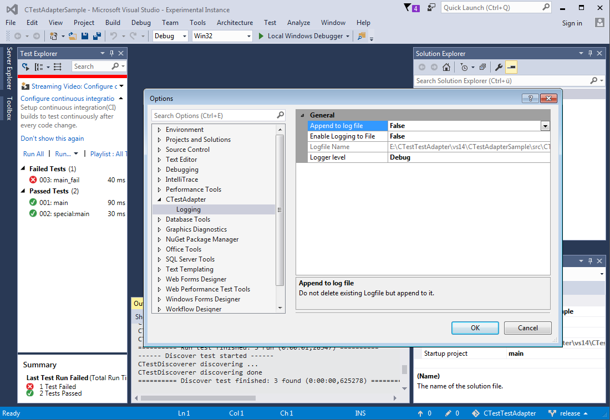

# CTestAdapter

CTestAdapter is a Visual Studio Extension which provides a test adapter to run [kitware's CMake/CTest](http://cmake.org/) from the Visual Studio Test Explorer.

## Supported Visual Studio versions

Currently the following versions of Visual Studio are supported:

* Visual Studio 2012 (11)
* Visual Studio 2013 (12)
* Visual Studio 2015 (14)
* Visual Studio 2017 (15)

## Features

* Discovers all tests which are added to your software using `add_test()` in your CMake scripts. 
* Discovers the correct CMake and CTest binary from the `CMakeCache.txt` in your solution directory.
* Control of test execution through Test Explorer Window
* Success or Fail based on Outcome of ctest run
* Shows console output of test if test fails
* Shows source line where test is executed in `CTestTestfile.cmake`
* Allows debugging of tests
  * You need the **[Microsoft Child Process Debugging Power Tool](https://marketplace.visualstudio.com/items?itemName=GreggMiskelly.MicrosoftChildProcessDebuggingPowerTool)** from Gregg Miskelly for attaching to the child processes which are spawned by ctest

  

----

## Building

For information how to build, test and debug CTestAdapter see [BUILDING](BUILDING.md).

----

## Credits

While this project is a complete rewrite of the original [CTestTestAdapter](https://github.com/toeb/CTestTestAdapter)
from Tobias Becker, it is based on his initial proof of concept and wouldn't have been possible without his work.

----

The CMake logo belongs to kitware and is under the Creative Commons license.
